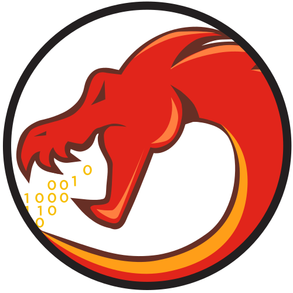
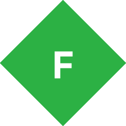

    

        🚀 Full-Stack Developer · SysAdmin · DevOps · Infrastructure · Reverse Engineering
    

<table align="center">

<tr>
    <td align="center"><strong>Languages</strong></td>
    <td align="center"><strong>Frontend Development</strong></td>
    <td align="center"><strong>Backend & Frameworks</strong></td>
</tr>

<tr>
    <td align="center">
        
        
        
        
        
        
        
        
        
        
        
        
        
        
        
        
        
        
        
    </td>

<td align="center">
    
    
    
    
    
    
    
    
    
</td>

<td align="center">
    
    
    
    
    
    
    
    
    
</td>

</tr>

<tr>
    <td align="center"><strong>Mobile & Cross-Platform</strong></td>
    <td align="center"><strong>Databases & Storage</strong></td>
    <td align="center"><strong>DevOps, Cloud & Infrastructure</strong></td>
</tr>

<tr>
    <td align="center">
        
        
        
        
        
        
        
        
    </td>

<td align="center">
    
    
    
    
    
    
    
    
    
</td>

<td align="center">
    
    
    
    
    
    
    
    
    
    
    
    
    
</td>

</tr>

<tr>
    <td align="center"><strong>Hosting & Game Infrastructure</strong></td>
    <td align="center"><strong>Reverse Engineering</strong></td>
    <td align="center"><strong>Game Modding & Analysis</strong></td>
</tr>

<tr>
    <td align="center">
        
        
        
        
        
        
    </td>

<td align="center">
    
    
    
    
    
</td>

<td align="center">
    
    
    
    
    <picture><source media="(prefers-color-scheme: dark)" srcset="img/game-modding/mono-light.svg"></picture>
    
    
    
    
</td>

</tr>

<tr>
    <td align="center"><strong>Monitoring & Automation</strong></td>
    <td align="center"><strong>Development Tools</strong></td>
    <td align="center"><strong>Cloud Platforms</strong></td>
</tr>

<tr>
    <td align="center">
        
        
        
    </td>

<td align="center">
    
    
    
    
    
    
    
</td>

<td align="center">
    
    
    
    
    
</td>

</tr>

</table>
